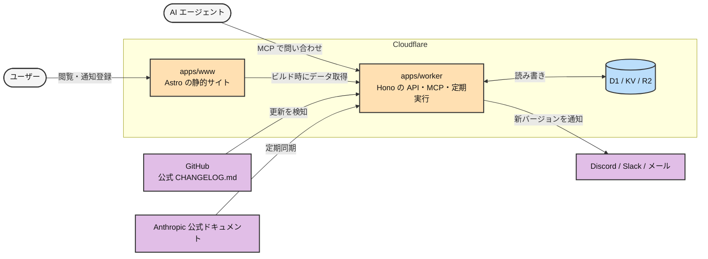
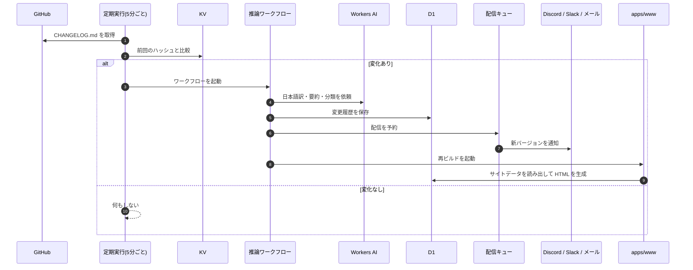

# CCログ超訳

Claude Code の更新履歴を分かりやすく表示する Web サイト。
Cloudflare Workers と D1 を使って、Claude Code の更新履歴を提供します。

## 特徴

- 公式 CHANGELOG.md の更新を 5 分ごとに検知し、AI で日本語訳・要約・分類して D1 に保存
- D1 をデータソースにした CHANGELOG と設定リファレンスの提供
- Discord・Slack・メールによる新バージョンの自動通知
- MCP サーバーによる CHANGELOG と設定リファレンスの提供
- pnpm workspace によるモノレポ構成
- Astro + Cloudflare Workers による高速な静的サイト
- TypeScript strict mode による型安全な実装

## 構成

pnpm workspace のモノレポで、`apps/www`(公開サイト)と `apps/worker`(バックエンド)の
2 つの Worker が `claude-code-log.com` を分担する。
`/api/*` と `/mcp` を `apps/worker` が受け、それ以外のパスを `apps/www` の静的アセットが返す。
共通処理と Zod スキーマは `packages/` に置く。

### アプリケーション詳細

#### `apps/www`

公開サイト。Astro の静的出力(`output: 'static'`)で、表示のみを担当する。
データの取得・翻訳・保存はすべて `apps/worker` 側にあり、www はビルド時に
`/api/site-data/*` を呼んで HTML を生成する(`src/lib/site-data-loader.ts`)。
取得先は環境変数 `SITE_DATA_ORIGIN`(既定は本番ドメイン)で切り替える。

- 主な画面
  - `/changelog`、`/changelog/v{version}` — バージョン一覧と詳細(要約・変更項目・差分・関連ドキュメント)
  - `/features`、`/features/{area}` — 機能エリア別のまとめ
  - `/reference/settings`、`/reference/settings/{slug}` — settings.json と環境変数のリファレンス
  - `/posts/weekly`、`/posts/column` — 週次アップデート記事とコラム(ローカルの Markdown)
  - `/notify` — 通知の登録フォーム(Turnstile でボット判定し Worker へ POST)
  - `/admin/weekly` — 週次記事に載せる項目の選定画面。Cloudflare Zero Trust Access でメールアドレスを限定
- 主な機能
  - Pagefind による全文検索
  - RSS・sitemap・llms.txt・JSON-LD の出力と、コラムの OGP 画像生成

#### `apps/worker`

Hono 製のバックエンド。関数主体の DDD レイヤ構成(`domain` / `usecases` / `infrastructure` / エントリポイント)で、次の 5 つを担う。

1. CHANGELOG の更新検知と AI 推論
2. 通知の購読管理と配信
3. www 向けのデータ配信 API
4. MCP サーバーの公開
5. 公式ドキュメントの同期と D1 のバックアップ

- 主なエンドポイント
  - `GET /api/site-data/{changelog,settings,diff}` — www のビルド時に読むデータ
  - `POST /api/webhooks` — 通知チャンネルの登録(Turnstile 検証・レート制限あり)
  - `GET|POST /api/unsubscribe` — 通知の解除
  - `ALL /api/mcp`、`ALL /mcp` — MCP サーバー
  - `POST /api/uploads` — 週次記事の画像を R2 へ保存(Cloudflare Access で保護)
  - `POST /api/dispatch`、`POST /api/ingest/changelog` — 共有シークレットで保護した内部用
- 定期実行
  - 5 分ごと: 公式 CHANGELOG.md を取得してハッシュを比較し、変化があれば推論ワークフローを起動
  - 3 時間ごと: 公式ドキュメントと設定スキーマの同期
  - 毎日: 使われていないチャンネルの削除、設定リファレンスの生成
  - 毎週: D1 を R2 へバックアップ
- Cloudflare Workflows で長い処理を分割し、失敗すると GitHub Issue を自動で起票する
- 通知はキュー(`changelog-notification`)に積んでから 1 件ずつ配信し、3 回失敗したものは配信不能キューへ送る。メールアドレスは暗号化して保存する
- AI は Cloudflare Workers AI(AI Gateway 経由)を使う
- データストア: D1 2 つ(通知・CHANGELOG 用と、ドキュメント全文検索用の FTS5)、KV(検知したハッシュ)、R2(記事画像・バックアップ)

#### MCP サーバー

`https://claude-code-log.com/api/mcp` で CHANGELOG と設定リファレンスを提供する。

```bash
claude mcp add --transport http changelog https://claude-code-log.com/api/mcp
```

- 仕様は 2026-07-28、`createMcpHandler` によるステートレス構成(`legacy: 'stateless'` で 2025 era のクライアントも受け付ける)
- ツール:
  - `search_changelog` - キーワード検索(`query` / `prefix` / `limit`)
  - `get_changelog` - バージョン指定で要約と全変更項目(`version` / `lang`)
  - `get_settings_reference` - 設定リファレンス(`key` 完全一致 / `query` 検索 / 無指定でキー名一覧)
- エラーは `isError: true` とプレーンな日本語メッセージで返す
- Cloudflare の WebMCP ブリッジが同一オリジンの `/mcp` を決め打ちで呼ぶため、`/mcp` は `/api/mcp` へ内部で転送する

## システムアーキテクチャ

登場人物と役割。



更新を取り込んでから配信するまでの流れ。


