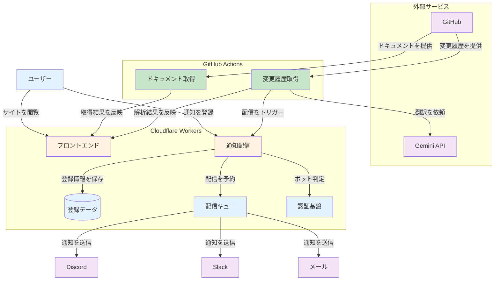

# CCログ超訳

Claude Code の更新履歴を分かりやすく表示する Web サイト。

GitHub Actions により自動的に最新の CHANGELOG と公式ドキュメントを取得し、Cloudflare Workers 上でホスティングされた静的サイトで提供します。

## 特徴

- GitHub Actions で CHANGELOG とドキュメントを定期取得
- AI による CHANGELOG の自動翻訳・推論(Gemini API 使用)
- Discord・Slack・メールによる新バージョンの自動通知
- pnpm workspace によるモノレポ構成
- Astro + Cloudflare Workers による高速な静的サイト
- TypeScript strict mode による型安全な実装

## プロジェクト構造

```
.
├── apps/
│   ├── www/                    # Astro フロントエンド (Cloudflare Workers)
│   ├── docs-tracker/          # Claude Code ドキュメント取得スクリプト
│   ├── changelog-fetcher/     # CHANGELOG パーサー
│   └── worker/               # 通知配信・MCP・CHANGELOG 検知 (Cloudflare Workers)
└── .github/workflows/         # GitHub Actions ワークフロー
```

### アプリケーション詳細

#### `apps/www`

- Astro ベースのフロントエンド
- Tailwind CSS によるスタイリング
- Cloudflare Workers へデプロイ

#### `apps/docs-tracker`

- Claude Code の公式ドキュメントを取得
- 3時間おきに定期実行
- 取得状況: `apps/docs-tracker/metadata/last_update.json`

#### `apps/changelog-fetcher`

- CHANGELOG.md をパースして JSON 化
- Gemini API による自動翻訳・推論
- 毎時実行
- 取得状況: `apps/changelog-fetcher/metadata/last_fetch.json`
- 解析結果(git 管理外の中間生成物): `apps/changelog-fetcher/analysis/analysis_v*.json`
- 推論結果: `apps/changelog-fetcher/inferred/inferred_v*.json`

#### `apps/worker`

- Cloudflare Workers + Hono ベースの通知配信 API
- Discord・Slack・メール(プレビュー版)による新バージョンの自動通知
- Cloudflare D1 でスーパータイプ/サブタイプ設計により登録者情報を管理
- Cloudflare Queues による非同期バッチ配信
- Cloudflare Turnstile による Bot 対策
- API エンドポイント:
  - `POST /api/webhooks` - 通知登録(Turnstile 認証 + テスト通知送信)
  - `POST /api/dispatch` - 配信トリガー(Bearer トークン認証、GitHub Actions から呼び出し)
  - `POST /api/unsubscribe` - 配信停止
  - `POST /api/mcp` - MCP サーバー(後述)
- 連続送信失敗 3 回で自動停止するエラーハンドリング

#### MCP サーバー

`https://claude-code-log.com/api/mcp` で CHANGELOG と設定リファレンスを提供する。

```bash
claude mcp add --transport http changelog https://claude-code-log.com/api/mcp
```

- 仕様は 2026-07-28、`createMcpHandler` によるステートレス構成(`legacy: 'stateless'` で 2025 era のクライアントも受け付ける)
- ツール:
  - `search_changelog` - キーワード検索(`query` / `prefix` / `limit`)
  - `get_changelog` - バージョン指定で要約と全変更項目(`version` / `lang`)
  - `get_settings_reference` - 設定リファレンス(`key` 完全一致 / `query` 検索 / 無指定でキー名一覧)
- エラーは `isError: true` とプレーンな日本語メッセージで返す

## システムアーキテクチャ



## 技術スタック

- Astro
- Hono
- TypeScript ~5.9.3
- Tailwind CSS
- Biome
- Zod
- pnpm
- Cloudflare Workers / D1 / Queues
